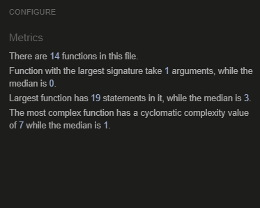
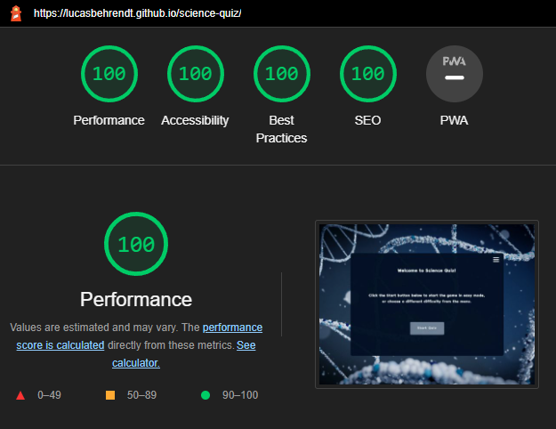
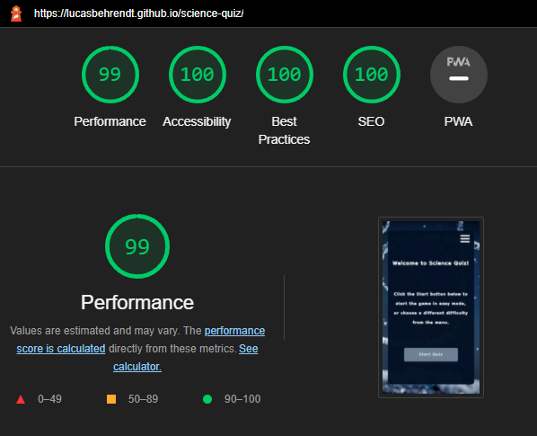

# Science Quiz

Science Quiz is an interactive quiz game that aims to entertain users with a fun and challenging quiz. It consists of three different difficulty levels, with Easy as the default difficulty. Simply click "Start Quiz" on the home page for a quick way straight into the game. Science Quiz offers a fun way to test your knowledge, as well as learn new and interesting facts in the field of science.

[Find the live website here!](https://lucasbehrendt.github.io/science-quiz/)


# Table of Contents
- [Science Quiz](#science-quiz)
  * [User Experience (UX)](#user-experience-ux)
    + [Site Owner Goals](#site-owner-goals)
    + [User Goals](#user-goals)
    + [Structure](#structure)
    + [Design](#design)
  * [Wireframes](#wireframes)
  * [Features](#features)
    + [Menu icon](#menu-icon)
    + [Home Page](#home-page)
    + [Quiz Page](#quiz-page)
    + [Results Page](#results-page)
    + [Menu Page](#menu-page)
    + [Difficulty Page](#difficulty-page)
    + [How to Play Page](#how-to-play-page)
    + [Features Left to Implement](#features-left-to-implement)
  * [Testing](#testing)
    + [Validator Testing](#validator-testing)
    + [Responsive Testing](#responsive-testing)
    + [Lighthouse Testing](#lighthouse-testing)
    + [Links and Form Testing](#links-and-form-testing)
    + [Fixed Bugs](#fixed-bugs)
    + [Known/Unfixed Bugs](#knownunfixed-bugs)
  * [Technologies Used](#technologies-used)
    + [Languages](#languages)
    + [Programs & Libraries](#programs--libraries)
  * [Deployment](#deployment)
    + [Github Pages](#github-pages)
    + [Cloning](#cloning)
  * [Credits](#credits)
    + [Code](#code)
    + [Content](#content)
    + [Media](#media)
    + [Acknowledgements](#acknowledgements)

<small><i><a href='http://ecotrust-canada.github.io/markdown-toc/'>Table of contents generated with markdown-toc</a></i></small>

## User Experience (UX) 
### Site Owner Goals

- Provide an entertaining and challenging quiz game that users enjoy.
- Present a well designed, structured website with clear purpose and navigation.
- Leave the user with a sense of accomplishment and some new knowledge.

### User Goals

- Understand the purpose of the game instantly.
- Have a positive feeling from the design and structure of the website.
- Test my knowledge in a fun and reasonably time consuming game.
- Easily navigate the site and be able to choose different difficulty levels.
- Receive feedback on my score and be able to easily play again.

### Structure

The structure of the website is designed to be simple, but professional looking. When designing the site, the decision to not use a conventional header or footer was deemed the most appropriate. This helps keep the site looking clean and slimmed, while also having a very appealing layout. Users should be able to intuitively navigate the site with the burger icon, and all sections of the site are easily accessible. Users are greeted on the home page with a quick way to start the quiz, or the option to navigate the menu. From the menu the user can either select a difficulty setting, visit the "How To Play" page, or go back to the home page. The quiz game is structured in a logical and recognizable way. Feedback is given on all user interactions, such as navigating the menu, hovering over buttons, or answering quiz questions, to keep the user engaged. When all questions are answered, the user is presented with the result. A message that reflects the score is displayed, and a "Play Again" button takes the user back to the home page.

### Design
- #### Colours

  The colour scheme chosen for the website was generated with [Coolors](https://coolors.co/), by creating a palette from the background image. This makes for an inviting and aesthetically pleasing website which adds to the overall experience of the game. The font colour throughout the game is a near white colour (#FBFEFF) that provides good contrast with both the background colour of the game section (#021025) and the buttons background colour (#708298). 

- #### Typography

  The font used is Dongle Regular for all content in the site. After careful consideration, and many tests with other fonts, Dongle Regular works best with the content and feel of the game itself. If for some reason the font isn't imported correctly, Sans-serif will serve as fallback.

- #### Imagery

  The background image of the website, which is the only image in the site, was chosen to convey a scientific theme and to be visually striking. The image is an artistic representation of a DNA spiral structure against a dark blue background. As mentioned above, the colour palette was generated from this image. This guarantees that all colours work very well together.

## Wireframes

Wireframes were created using Balsamiq.

<details>

<summary>Desktop wireframes</summary>


</details>

<details>

<summary>Mobile wireframes</summary>


</details>

## Features

In the following section I will provide an overview of the features included in Science Quiz. The site consists of a single html file with multiple pages, which are visible one at a time. The background image is visible throughout all pages, and the quiz game in the middle of the site holds all the different pages. All features have been made responsive across all devices.

### Menu icon

- The menu icon is a so called burger icon that users can utilize to navigate throughout the site. When clicked, the icon will animate into an X and the menu will appear. To close the menu, simply click the X and the home page will be displayed again. The menu itself will be covered further down this file.

<details>

<summary>Menu icon</summary>


</details>

### Home Page

- The home page consists of a title that instantly shows the user the purpose of the site, and a message to clarify the next step to be taken by the user. There is a button at the bottom of the page labelled "Start Quiz" which if clicked, starts the quiz in the default easy mode, as stated by the message above the button. This page is designed to be inviting and simple, with a quick and easy path into the quiz itself.

- On smaller screen sizes the layout remains the same, and the text elements are adapted to fit the page in a pleasing way. The button at the bottom is reduced in height to improve the layout.

<details>

<summary>Home Page image - Desktop</summary>


</details>

<details>

<summary>Home Page image - Mobile</summary>


</details>

### Quiz Page

- The quiz page is the heart of the site, and will be displayed when the user either clicks "Start Quiz" on the home page or chooses a difficulty from the menu. 

- At the top of the page lies a game bar. At the left side of the game bar a home icon is found, which if clicked takes the user back to the home page. In the middle there is a question counter which increments with each question answered, and to the right in the game bar a score count can be found, which will keep track of the number of correct answers submitted by the user.

- The current quiz question is displayed below the game bar, with four options presented as buttons in a 2x2 grid below the question. When a user answers a question, the result will be displayed in the form of the option clicked either turning green for a correct answer, or red for an incorrect answer. If answered incorrect, the correct answer will turn green as well, to help the user learn and hopefully be able to score better on a new try. When the current question has been answered a button that generates the next question will be displayed below the options, and the current options buttons are disabled so no cheating can occur.

- The 10 questions that the user answers is generated as a shuffled array when the user initiates the quiz. This prevents the quiz from becoming repetitive. As the user answers questions and the question counter reaches 10, the quiz game is completed and the results will be displayed.

- On mobile devices the quiz page layout will be adjusted to fit the screen size better. The game bar and quiz question will remain the same, but the options and the next question button will change to a column. The buttons are reduced in height for a better fit.

<details>

<summary>Game Bar</summary>


</details>

<details>

<summary>Quiz Page image - Desktop</summary>


</details>

<details>

<summary>Quiz Page image - Mobile</summary>


</details>

<details>

<summary>Quiz Page image - Correct Answer</summary>


</details>

<details>

<summary>Quiz Page image - Incorrect Answer</summary>


</details>

### Results Page

- The results page will automatically be displayed when the user has answered all ten questions. The main purpose of this page is to give the user a sense of accomplishment, or an urge to try and get a better score so the user plays again. A message which depends on the score achieved by the user is displayed, and a "Play Again" button below the message encourages the user to try and achieve a better score or, if all questions were answered correctly, to try the quiz in a different difficulty setting.

- The results page maintains the same layout on smaller screen sizes, with only some minor adjustments to the text elements. The button is reduced in height for a consistent responsiveness throughout the pages.  

<details>

<summary>Results Page image - Desktop</summary>


</details>

<details>

<summary>Results Page image - Mobile</summary>


</details>

### Menu Page

- The menu is a small navigation menu that adds to the overall experience, while maintaining a simple and elegant structure. By clicking the burger icon the user can access the menu and, from here, navigate to Home, Difficulty or How to Play. The Home button simply directs the user back to the home page, while the Difficulty and How to Play buttons takes the user to the corresponding pages, which will be described below this feature.

- On smaller screen sizes the layout remains the same, and the buttons are slimmed in the same way as the other pages.

<details>

<summary>Menu Page image - Desktop</summary>


</details>

<details>

<summary>Menu Page image - Mobile</summary>


</details>

### Difficulty Page

- As suggested by the name, this page lets the user choose the difficulty of the quiz. The page can be accessed from the menu by clicking the burger icon in the upper right corner. As the user clicks one of the buttons the quiz starts in the selected difficulty with a randomized array of 10 questions.

- When viewed on smaller devices the responsiveness behaves much like the menu does, with little changes to the layout.

<details>

<summary>Difficulty Page image - Desktop</summary>


</details>

<details>

<summary>Difficulty Page image - Mobile</summary>


</details>

### How to Play Page

- This page is simply a short description of how to play the quiz, and navigate the website. 

- On smaller screen sizes the text elements will adjust to maintain a pleasing structure.

<details>

<summary>How to Play Page image - Desktop</summary>


</details>

<details>

<summary>How to Play Page image - Mobile</summary>


</details>

### Features Left to Implement

- A system that keeps highscores and incentivizes the user even more to try and beat their previous score.
- A large database of quiz questions to allow the user to play the quiz multiple times without having to answer the same questions over and over.

## Testing
### Validator Testing

- To ensure that all HTML code of the website is correct, validation through the W3C Markup Validator was performed and no errors were found in the HTML code. There was, however, some warnings that was fairly simple to solve.

  - The home icon on the quiz page and results page has an Aria-label to improve accessibility. Since an icon element does not register as a link or button, a warning was issued that said "possible missuse of aria-label". After some searching for the best solution, this was solved by wrapping the icon in a button element and styling it to maintain the same appearance.

  - The different pages in the website were initially sections, but this caused a warning which stated that "section lacks heading element". Since a heading element was not necessary in a few of the sections the best solution would simply be to replace the section elements with divs.

  - After handling these warnings there are now no errors or warnings in the website.

  - [W3C Markup Validator](https://validator.w3.org/) - [Results](https://validator.w3.org/nu/?doc=https%3A%2F%2Flucasbehrendt.github.io%2Fscience-quiz%2F)

- Validation of the CSS code was performed through the W3C CSS Validator. No errors or warnings were found in the process. WARNING??

  - [W3C CSS Validator](https://jigsaw.w3.org/css-validator/) - [Results]()

- The JSHint Code Quality Tool was used to validate all JavaScript code. As the code for the website has two JavaScript files for better readability, they were copied and pasted together in JSHint and no errors were found. A few warnings, all related to a couple of missed semicolons, were quickly fixed.

  - [JSHint Code Quality Tool](https://jshint.com/) 
  
    <details>
  
    <summary>Results</summary>
  
    
  
    </details>

### Responsive Testing

- You can open DevTools with keyboard shortcuts (CMD+Opt+I for Mac OS or Ctrl+Shift+I for Linux and Windows), through the menu bar in the top right corner and go to “More Tools” > “Developer Tools.” or by rightclicking on any web page and select "Inspect". To test responsiveness click on the "device" icon on the left side, above the source code window or with the keyboard shortcut CMD+Shift+M for Mac OS or Ctrl+Shift+M for Linux and Windows. Under 'Dimensions' you can choose between different devices to emulate, or you can drag the handles to resize the window to your preffered screen width by choosing 'Responsive'.

- To test the responsiveness of the website multiple devices were used to play the quiz on including a Desktop, Laptop, Ipad Air, Samsung Galaxy S20, Iphone 12, Iphone X, Iphone 8 and Iphone SE(2016). The site was also tested on different browsers, such as Chrome, Edge, Safari and Firefox.

- Using Chrome DevTools, the site was optimized for all screen widths down to 320px.

### Lighthouse Testing

- The Lighthouse tool in Chrome DevTools was used to test the sites performance, accessibility, best practices and SEO. The website performed well in the tests, indicating a well-structured site that is highly accessible.

<details>
  
<summary>Lighthouse Report - Desktop</summary>
  

  
</details>

<details>
  
<summary>Lighthouse Report - Mobile</summary>
  

  
</details>

### Links and Form Testing

- All navigational links and buttons have been tested to ensure that no broken links exists and that the correct targets are reached. The menu is behaving correctly and the buttons to start the quiz are all responding as expected.

- All buttons in the quiz game responds as expected and, when a question is answered, the buttons are disabled. If the home icon is clicked while the quiz is running, the page is refreshed and the user is taken to the home page. The "Next Question" button correctly iterates through the array of quiz questions until the maximum question count is reached. Both the question count and the score count increments as expected.

- When all 10 questions are answered the results page is displayed as expected. Depending on the users score, the correct corresponding message is displayed. The "Play Again" button reloads the page as expected. The home icon behaves the same as on the quiz page.

### Fixed Bugs

- When answering a quesion wrong, the button did not turn red instantly, but only after the cursor was moved slightly and not all options buttons had the hover function disabled. Instead of disabling the hover function in an if/else statement, all buttons are now looped through to disable them correctly. This also fixed the issue with the "wrong answer" button not turning red instantly on desktop and laptops.

- When playing the quiz game on mobile devices the "wrong answer" colour issue persisted, and to solve this the hover effect on all buttons were removed on devices that utilize touchscreens. When using these devices the hover effect has no meaning anyway since most commonly a mouse is not used.

- When clicking the "Next Question" button in the quiz game, a new question was not generated. The question count was incremented, but the same question was displayed. This was caused by an error in the function that calls the next question in the shuffled array. By examining the code the error was found in the loop to display the question, which was given the index[0] of the array. After changing this to a variable that increments with each "Next Question" button click, the solution was found.

- When playing the quiz on mobile devices the home icon was positioned incorrectly. This was due to an error in style.css where a media query was mislabelled. By labelling it correctly, the issue was resolved.

### Known/Unfixed Bugs

- When viewed in landscape mode on mobile devices, the quiz game crops out and all buttons are not visible. A solution to this was harder than expected and after trying for a while, the fix still didn't work. I decided to leave the game as is, mostly due to lack of time and not finding a satisfying solution that wouldn't affect other parts of the website. A solution is planned to be implemented at a later stage.

## Technologies Used
### Languages

- [HTML5](https://en.wikipedia.org/wiki/HTML5)

- [CSS3](https://en.wikipedia.org/wiki/CSS)

- [JavaScript](https://www.javascript.com/)

### Programs & Libraries

- [Balsamiq](https://balsamiq.com/) - The wireframes used for the site was created with Balsamiq.

- [Chrome DevTools](https://developer.chrome.com/docs/devtools/) - A powerful tool used throughout the creation of the website.

- [Coolors](https://coolors.co/) - The colour palette was generated with the help of Coolors.

- [Favicon](https://favicon.io/) - The favicon visible in the websites tab was taken from here.

- [Font Awesome](https://fontawesome.com/) - The icon in the site was provided by Font Awesome.

- [Git](https://git-scm.com/) - Git was used through the Gitpod terminal to commit to Git and push to Github.

- [Github](https://github.com/) - All code for the site is stored on Github after being pushed from Git. Github Pages serves as host for the site.

- [Google Fonts](https://fonts.google.com/) - The font used on the site was imported from Google Fonts.

- [JSHint](https://jshint.com/) - Validation of JavaScript code was done with JSHint.

- [Techsini](http://techsini.com/multi-mockup/index.php) - The responsive image at the top of the README came from Techsini.

- [Triviawell](https://www.triviawell.com/) - All questions for the quiz was taken from Triviawell. 

- [Unsplash](https://unsplash.com/) - The background image for the site was provided by Unsplash.

- [W3C](https://www.w3.org/) - Validation of HTML and CSS code was done with W3C.

## Deployment
### Github Pages

The website was deployed using GitHub Pages. The steps for the deployment process are:

1. Log in to your GitHub account.

2. On the left side of the screen, choose the repository you wish to deploy.

3. At the top of the repository, select "settings".

4. In the navigation bar to the left, click the "Pages" section.

5. Under 'Source', select the 'Main' branch and click 'Save'.

6. The site should be live in a few minutes, indicated by a green background with the words " Your site is published at (live address)"

The live link can be found here - [Science Quiz](https://lucasbehrendt.github.io/science-quiz/)

### Cloning

The repository for the website can be cloned to a local machine. The cloning procedure pulls down a full copy of all the data on GitHub.com at that time. The steps required for the clone are:

1. Navigate to the main page of the repository you wish to clone.

2. Above the list of files, click the "code" button.

3. To clone the repository using HTTPS, under "clone with HTTPS", copy the URL provided.

4. Open Git Bash.

5. Change the current working directory to the location where you want the cloned directory.

6. Type `git clone`, and then paste the URL you copied earlier.
     ```
    $ git clone https://github.com/YOUR-USERNAME/YOUR-REPOSITORY`
    ```
7. Press Enter to create your local clone.
    ```
    $ git clone https://github.com/YOUR-USERNAME/YOUR-REPOSITORY
    > Cloning into `Clone-dir`...
    > remote: Counting objects: 10, done.
    > remote: Compressing objects: 100% (8/8), done.
    > remove: Total 10 (delta 1), reused 10 (delta 1)
    > Unpacking objects: 100% (10/10), done.
    ```
For a more detailed explanation, see this [walkthrough](https://docs.github.com/en/repositories/creating-and-managing-repositories/cloning-a-repository).

## Credits
### Code

- [Stackoverflow](https://stackoverflow.com/) helped me implement a [hover disable](https://stackoverflow.com/questions/23885255/how-to-remove-ignore-hover-css-style-on-touch-devices) on touch devices and was a great source of inspiration on how to come up with my own solutions.

- [Dev.to](https://dev.to/codebubb/how-to-shuffle-an-array-in-javascript-2ikj) provided a simple and elegant solution how to shuffle the quiz questions array.

- This [Quora](https://www.quora.com/How-to-unhover-an-element-with-an-active-hover-with-JS) post helped me figure out how to disable the hover effect when an answer has been submitted.

- [W3Schools](https://www.w3schools.com/) helped me find some great solutions for features implemented on the site, such as the [burger menu icon](https://www.w3schools.com/howto/howto_css_menu_icon.asp) and how to use [grid positioning](https://www.w3schools.com/css/css_grid.asp).

- My mentor Brian helped me throughout the project, including adjusting the scope to a reasonable size, how to clean up and properly write and comment the code, and more.

### Content

- The font used in the site was imported from [Google Fonts](https://fonts.google.com/).

- All quiz questions were taken from [Triviawell](https://www.triviawell.com/questions/science).

### Media

- The background image was provided by [Unsplash (sorce to the image)](https://unsplash.com/photos/Mm1VIPqd0OA).

- The favicon was taken fron [Favicon.io](https://favicon.io/) and is credited in the code, with a link to the source.

- The icon used in the site was taken from [Font Awesome](https://fontawesome.com/).

### Acknowledgements

- My mentor Brian for valuable insight on what to focus on when learning JavaScript, and for help with the coding itself.

- Family and friends, who helped me feel less overwhelmed when struggling with the JavaScript code.

[Back to top](#science-quiz)