# Science Quiz

Science Quiz is an interactive quiz game that aims to entertain users with a fun and challenging quiz. It consists of three different difficulty levels, with Easy as the default difficulty. Simply click "Start Quiz" on the home page for a quick way straight into the game. Science Quiz offers a fun way to test your knowledge, as well as learn new and interesting facts in the field of science.

[Find the live website here!](https://lucasbehrendt.github.io/science-quiz/)

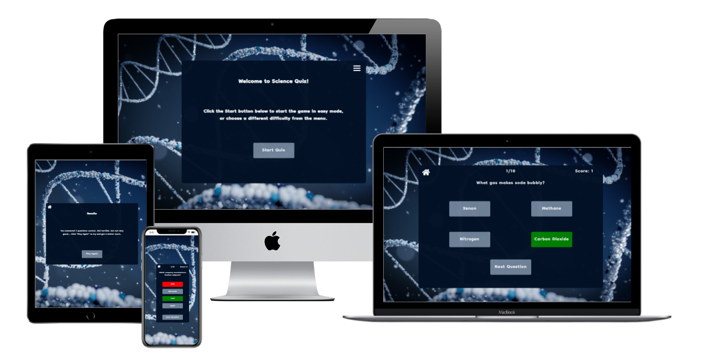

## User Experience (UX) 
### Site Owner Goals

- Provide an entertaining and challenging quiz game that users enjoy.
- Present a well designed, structured website with clear purpose and navigation.
- Leave the user with a sense of accomplishment and some new knowledge.

### User Goals

- Understand the purpose of the game instantly.
- Have a positive feeling from the design and structure of the website.
- Test my knowledge in a fun and reasonably time consuming game.
- Easily navigate the site and be able to choose different difficulty levels.
- Receive feedback on my score and be able to easily play again.

### Structure

The structure of the website is designed to be simple, but professional looking. Users should be able to intuitively navigate the site with the burger icon, and all sections of the site are easily accessible. Users are greeted on the home page with a quick way to start the quiz, or the option to navigate the menu. From the menu the user can either select a difficulty setting, visit the "How To Play" page, or go back to the home page. The quiz game is structured in a logical and recognizable way. Feedback is given on all user interactions, such as navigating the menu, hovering over buttons, or answering quiz questions, to keep the user engaged. When all questions are answered, the user is presented with the result. A message that reflects the score is displayed, and a "Play Again" button takes the user back to the home page.

### Design
- #### Colours

  The colour scheme chosen for the website was generated with [Coolors](https://coolors.co/), by creating a palette from the background image. This makes for an inviting and aesthetically pleasing website which adds to the overall experience of the game. The font colour throughout the game is a near white colour (#FBFEFF) that provides good contrast with both the background colour of the game section (#021025) and the buttons background colour (#708298). 

- #### Typography

  The font used is Dongle Regular for all content in the site. After careful consideration, and many tests with other fonts, Dongle Regular works best with the content and feel of the game itself. If for some reason the font isn't imported correctly, Sans-serif will serve as fallback.

- #### Imagery

  The background image of the website, which is the only image in the site, was chosen to convey a scientific theme and to be visually striking. The image is an artistic representation of a DNA spiral structure against a dark blue background. As mentioned above, the colour palette was generated from this image. This guarantees that all colours work very well together.

## Wireframes

Wireframes were created using Balsamiq.

Desktop wireframes

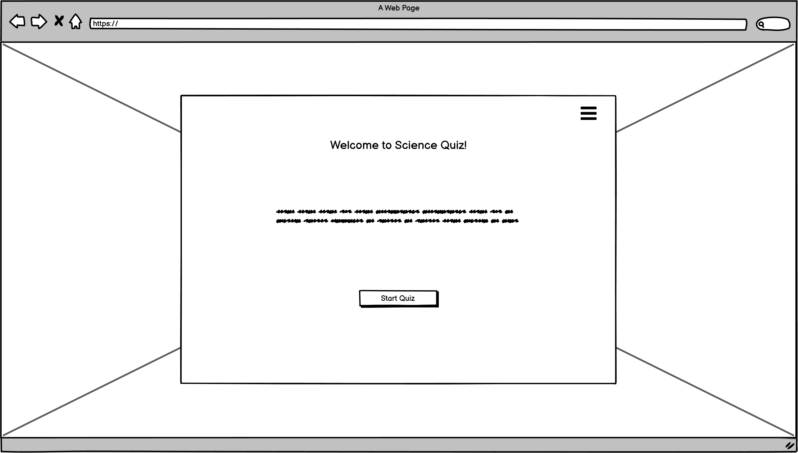
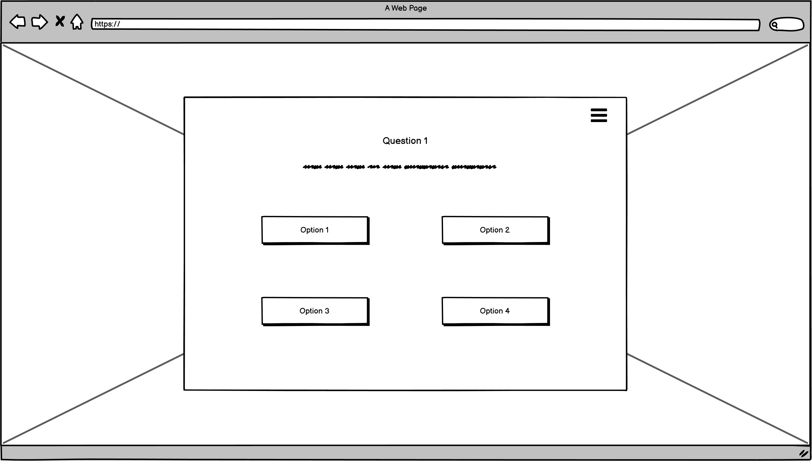
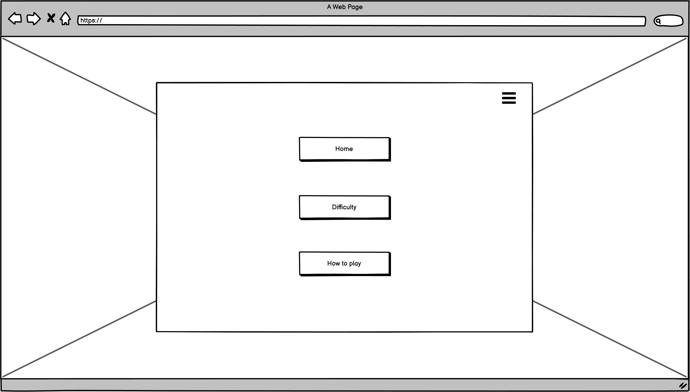
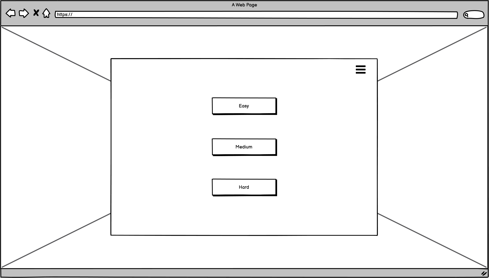
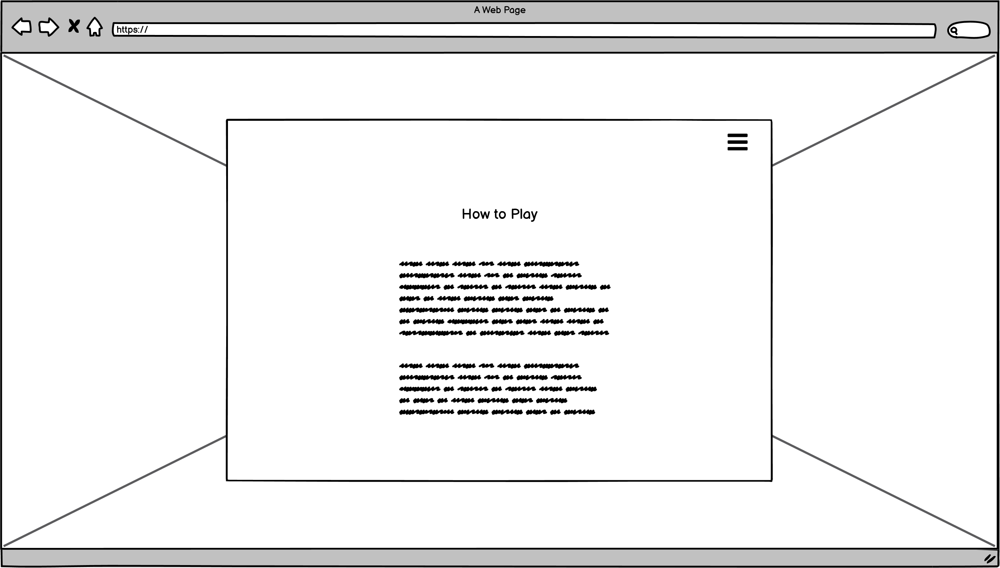

Mobile wireframes

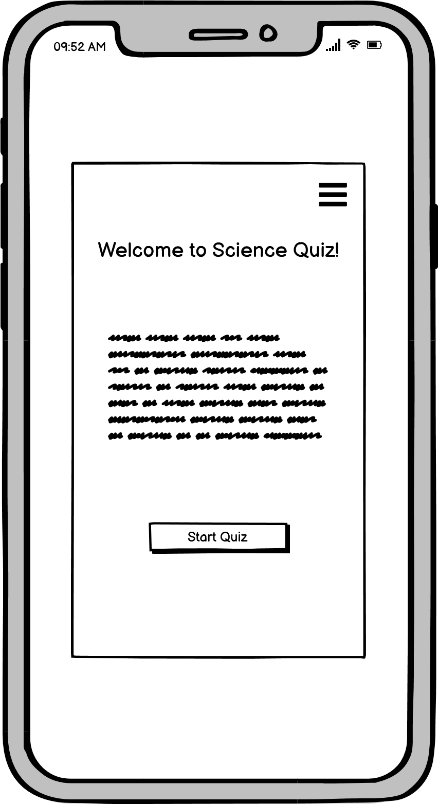
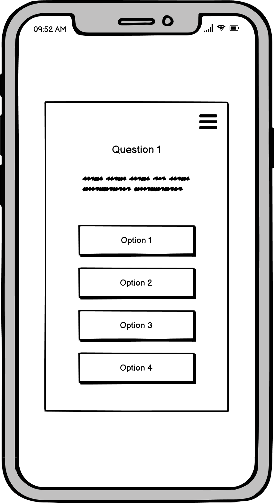

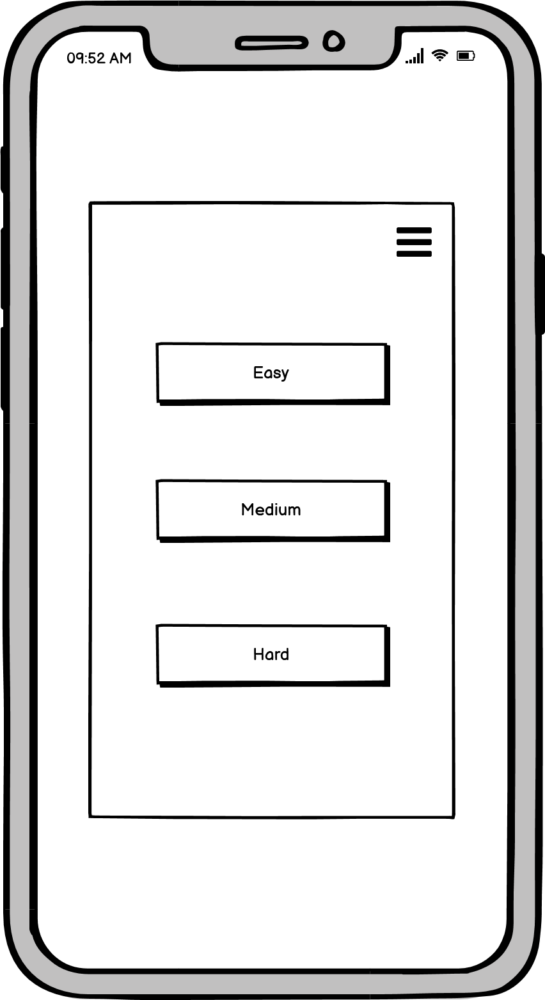

## Features

In the following section I will provide an overview of the features included in Science Quiz. The site consists of a single html file with multiple pages, which are visible one at a time. The background image is visible throughout all pages, and the quiz game in the middle of the site holds all the different pages. All features have been made responsive across all devices.

### Menu icon

- The menu icon is a so called burger icon that users can utilize to navigate throughout the site. When clicked, the icon will animate into an X and the menu will appear. To close the menu, simply click the X and the home page will be displayed again. The menu itself will be covered further down this file.

Menu icon

### Home Page

- The home page consists of a title that instantly shows the user the purpose of the site, and a message to clarify the next step to be taken by the user. There is a button at the bottom of the page labelled "Start Quiz" which if clicked, starts the quiz in the default easy mode, as stated by the message above the button. This page is designed to be inviting and simple, with a quick and easy path into the quiz itself.

- On smaller screen sizes the layout remains the same, and the text elements are adapted to fit the page in a pleasing way. The button at the bottom is reduced in height to improve the layout.

Home Page image - Desktop

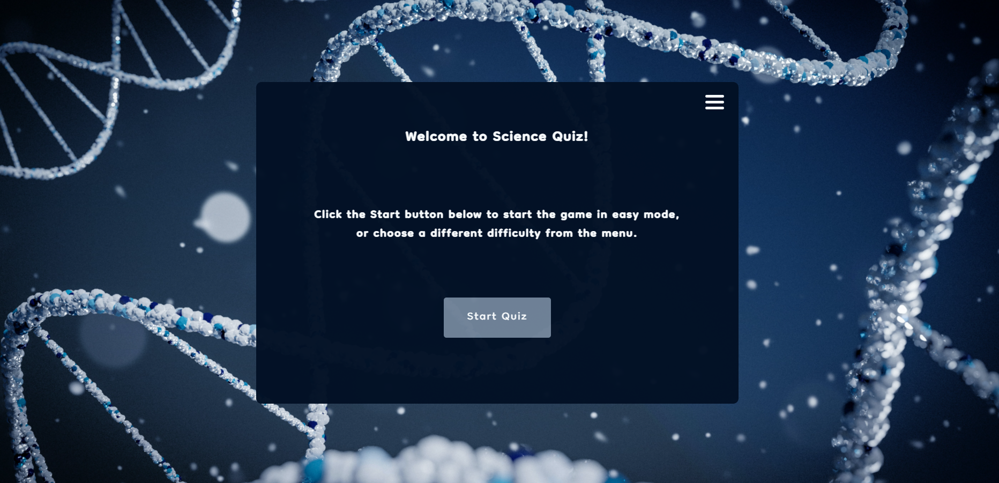

Home Page image - Mobile

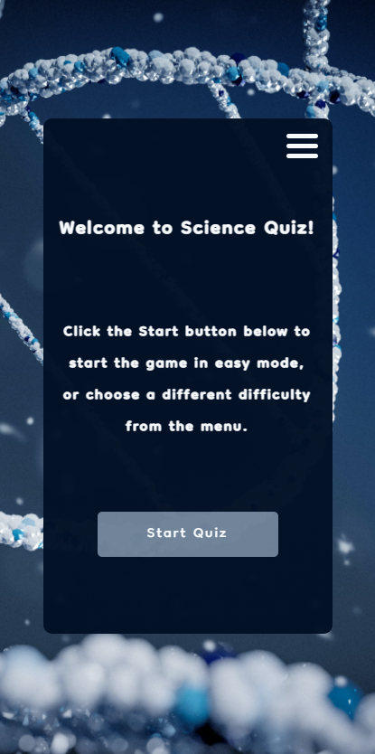

### Quiz Page

- The quiz page is the heart of the site, and will be displayed when the user either clicks "Start Quiz" on the home page or chooses a difficulty from the menu. 

- At the top of the page lies a game bar. At the left side of the game bar a home icon is found, which if clicked takes the user back to the home page. In the middle there is a question counter which increments with each question answered, and to the right in the game bar a score count can be found, which will keep track of the number of correct answers submitted by the user.

- The current quiz question is displayed below the game bar, with four options presented as buttons in a 2x2 grid below the question. When a user answers a question, the result will be displayed in the form of the option clicked either turning green for a correct answer, or red for an incorrect answer. If answered incorrect, the correct answer will turn green as well, to help the user learn and hopefully be able to score better on a new try. When the current question has been answered a button that generates the next question will be displayed below the options, and the current options buttons are disabled so no cheating can occur.

- The 10 questions that the user answers is generated as a shuffled array when the user initiates the quiz. This prevents the quiz from becoming repetitive. As the user answers questions and the question counter reaches 10, the quiz game is completed and the results will be displayed.

- On mobile devices the quiz page layout will be adjusted to fit the screen size better. The game bar and quiz question will remain the same, but the options and the next question button will change to a column. The buttons are reduced in height for a better fit.

Game Bar

Quiz Page image - Desktop

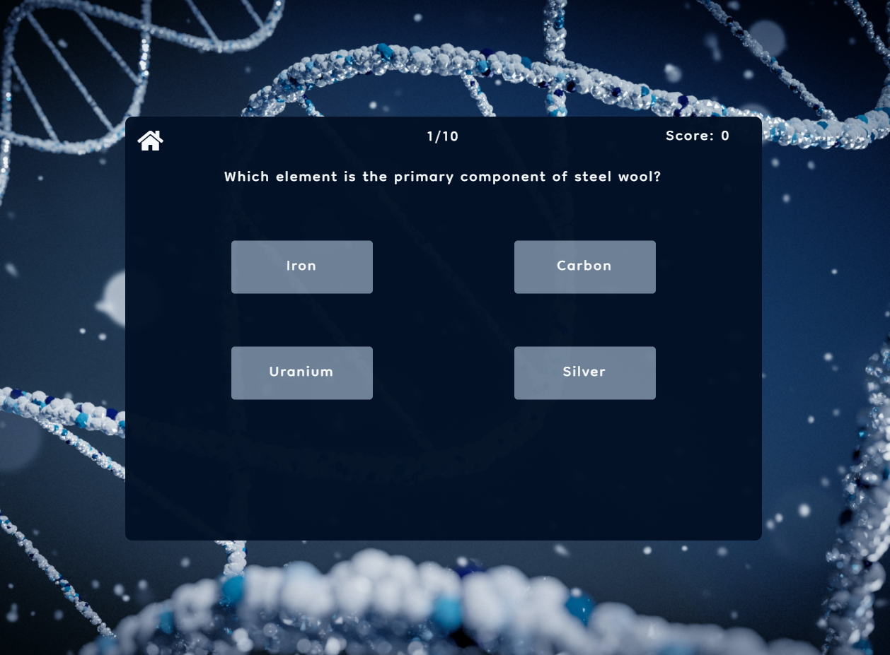

Quiz Page image - Mobile

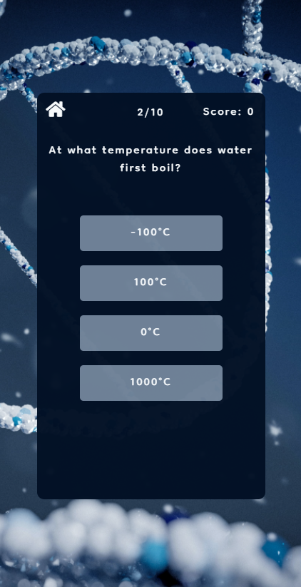

Quiz Page image - Correct Answer

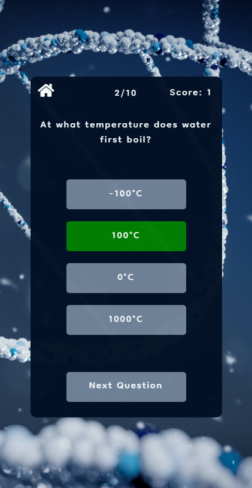

Quiz Page image - Incorrect Answer

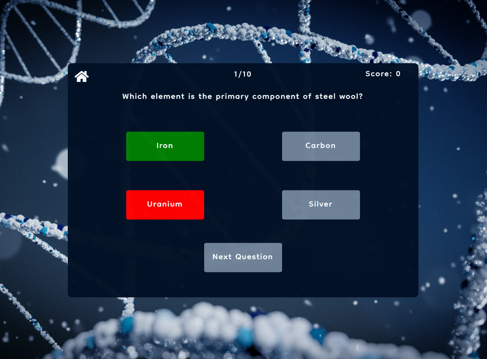

### Results Page

- The results page will automatically be displayed when the user has answered all ten questions. The main purpose of this page is to give the user a sense of accomplishment, or an urge to try and get a better score so the user plays again. A message which depends on the score achieved by the user is displayed, and a "Play Again" button below the message encourages the user to try and achieve a better score or, if all questions were answered correctly, to try the quiz in a different difficulty setting.

- The results page maintains the same layout on smaller screen sizes, with only some minor adjustments to the text elements. The button is reduced in height for a consistent responsiveness throughout the pages.  

Results Page image - Desktop

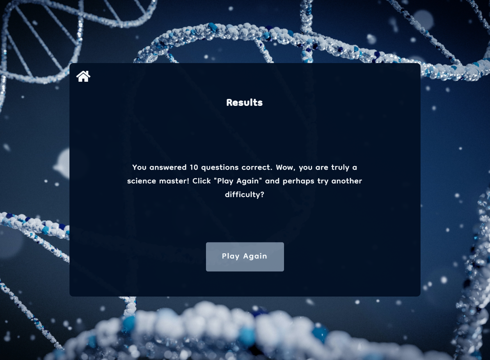

Results Page image - Mobile

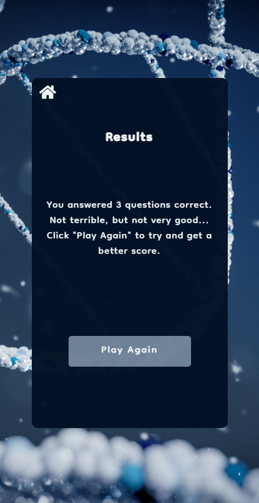

### Menu Page

- The menu is a small navigation menu that adds to the overall experience, while maintaining a simple and elegant structure. By clicking the burger icon the user can access the menu and, from here, navigate to Home, Difficulty or How to Play. The Home button simply directs the user back to the home page, while the Difficulty and How to Play buttons takes the user to the corresponding pages, which will be described below this feature.

- On smaller screen sizes the layout remains the same, and the buttons are slimmed in the same way as the other pages.

Menu Page image - Desktop

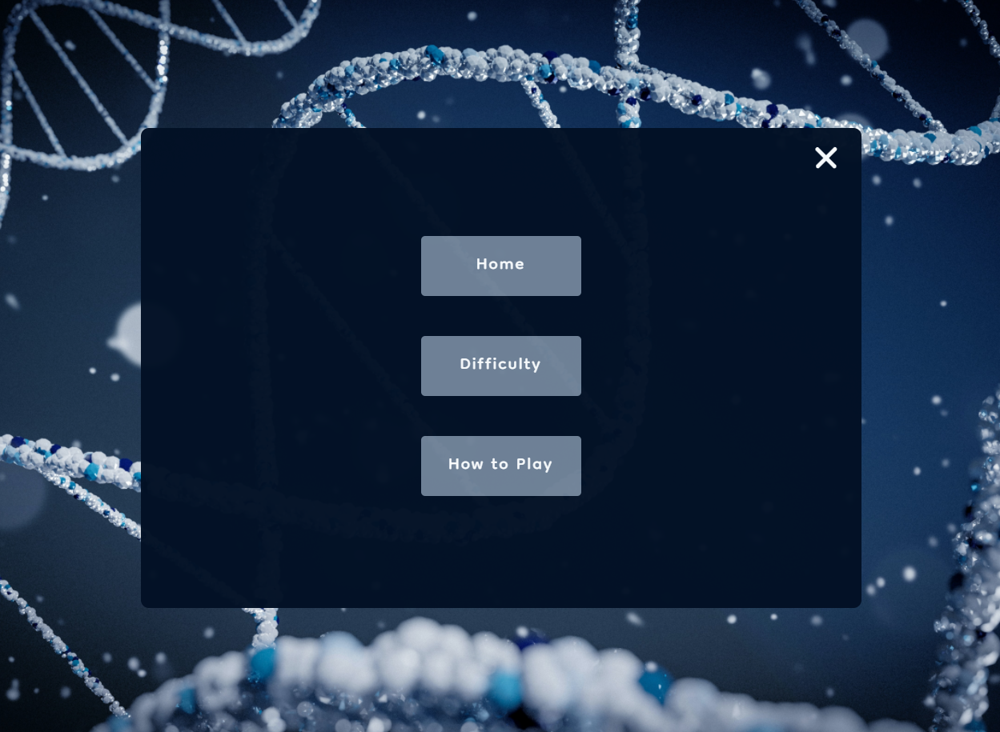

Menu Page image - Mobile

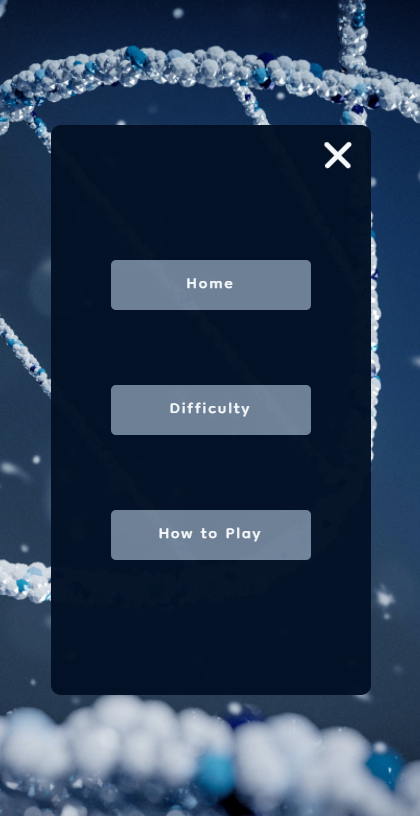

### Difficulty Page

- As suggested by the name, this page lets the user choose the difficulty of the quiz. The page can be accessed from the menu by clicking the burger icon in the upper right corner. As the user clicks one of the buttons the quiz starts in the selected difficulty with a randomized array of 10 questions.

- When viewed on smaller devices the responsiveness behaves much like the menu does, with little changes to the layout.

Difficulty Page image - Desktop

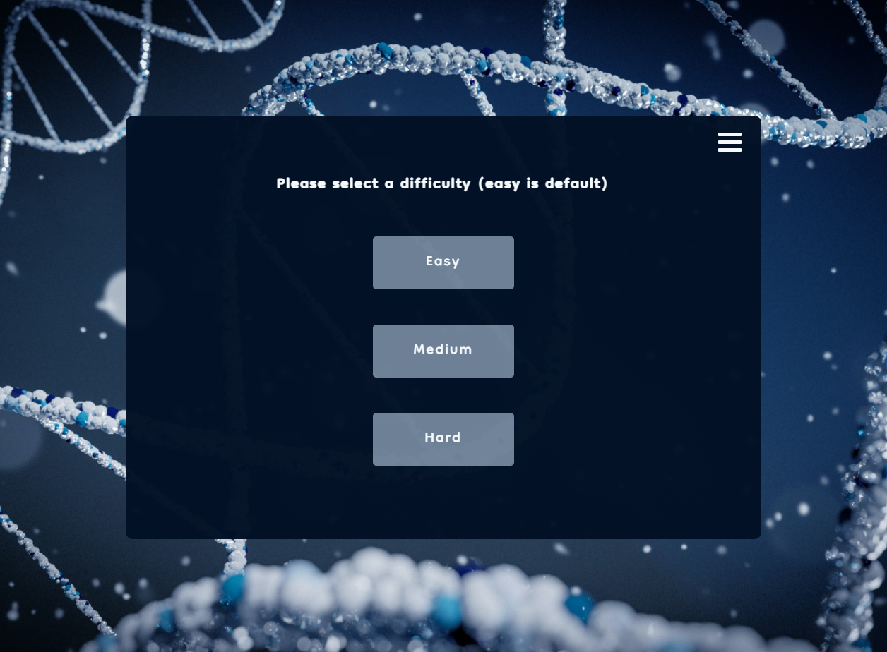

Difficulty Page image - Mobile

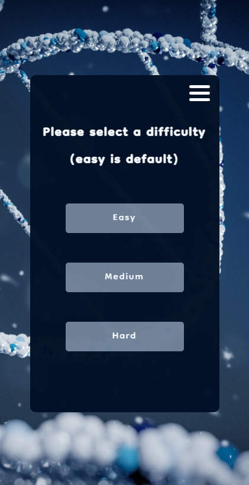

### How to Play Page

- This page is simply a short description of how to play the quiz, and navigate the website. 

- On smaller screen sizes the text elements will adjust to maintain a pleasing structure.

How to Play Page image - Desktop

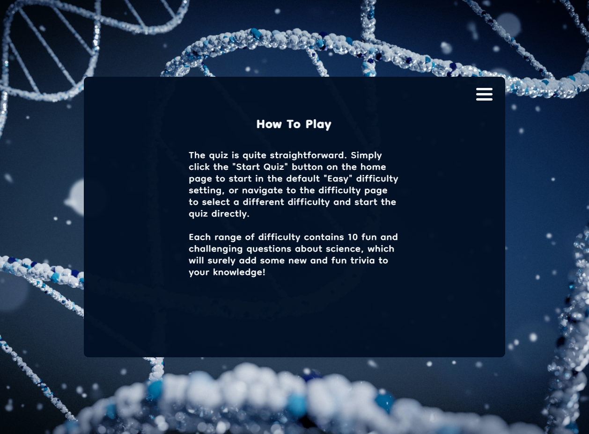

How to Play Page image - Mobile

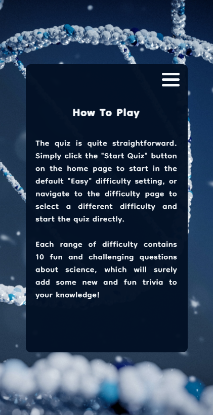

### Features Left to Implement

## Testing
### Validator Testing
### Responsive Testing
### Lighthouse Testing
### Links and Form Testing
### Fixed Bugs
### Known/Unfixed Bugs

## Technologies Used
### Languages
### Programs & Libraries

## Deployment

## Credits
### Code
### Content
### Media
### Acknowledgements
